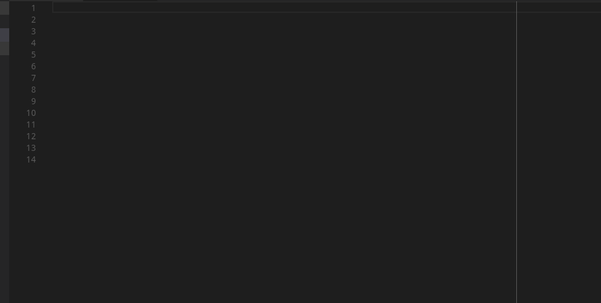
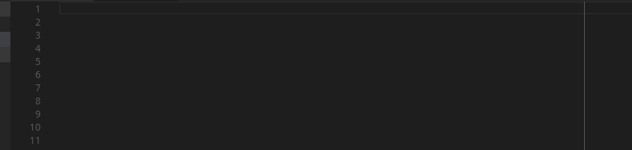
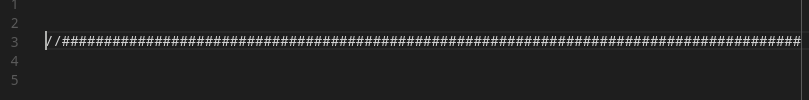

#   Hermes Comments 

Hermes Comments is a simple visual studio extension that I created to help structure C and C++ code (and other languages using // and /**/ comments). It's purpose is to automate the creation of more visually complex comments to structure and document code.

## Features

Using shortcuts you can now turn a selected text into one of three
possible formats, centered, left justified or subsection.

So far the extension supports lef justified section titles:

Centered section titles:

And subsection titles:

> To create a complex comment all you need is to highlight the desired text and use one of the shortcuts.

The shortcuts are:

* `alt+shit+p` Creates a centered title 
* `alt+shift+l` Creates a left justified title 
* `alt+shift+o`   Creates a subtitle
* `alt+shift+;` Creates a separator line

>The separator bar, created with `alt+shift+;` (; is the actual ';' key)

## Known Issues

Currently the way the comment is generated is not smart. It will modify your comments following the same set of rules, so it's not advisable to try to modify existing comments (for example doxygen documentation comments).

It won't handle comments whose length is bigger than 90 characters.

## Release Notes
----
### 1.0.0

Initial release of hermes comments

**Enjoy!**
