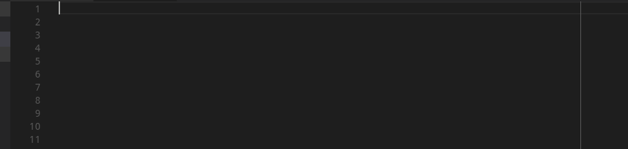

#   Hermes Comments 

Hermes Comments is a simple visual studio extension that I created to help structure C and C++ code (and other languages using // and /**/ comments). It's purpose is to automate the creation of more visually complex comments to structure and document code.

## Features

Using shortcuts you can now turn a selected text into one of three
possible formats, centered, left justified or subsection.

So far the extension supports lef justified section titles:

Centered section titles:

And subsection titles:

> To create a complex comment all you need is to highlight the desired text and use one of the shortcuts.

Support for modifying pre-existing comments

The shortcuts are:

* `alt+shit+p` Creates a centered title 
* `alt+shift+l` Creates a left justified title 
* `alt+shift+o`   Creates a subtitle
* `alt+shift+;` Creates a separator line

>The separator bar, created with `alt+shift+;` (; is the actual ';' key)

## Customizing the comments

You can decide which characters will be used to create the comments using the settings, just copy paste the following lines into your settings.json file:

    "hermes-comments.maximum": 50,
    "hermes-comments.fill": "-",
    "hermes-comments.frame": "^",
    "hermes-comments.title": "`",
    "hermes-comments.separator": "$",

`maximum` is the maximum level of alignment , i.e the horizontal width of a title.

`fill` is the character used ot fill the empty space in a frame.

When a comment contains the substring `author` the frame is different. `title` defines the character used for autorship frames.

`separator` defines the character used for the separator bar.

## Known Issues

Applying the commands twice eliminates empty lines in between text

It won't handle comments whose length is bigger than the maximum length of characters (90 by default).

## Release Notes
----
### 1.0.1

- Added support for pre-existing comments.
- Added the option to customize the characters used to make a frame.
- Added a special frame that is created for comments containing the word `author`

### 1.0.0

Initial release of hermes comments

**Enjoy!**
